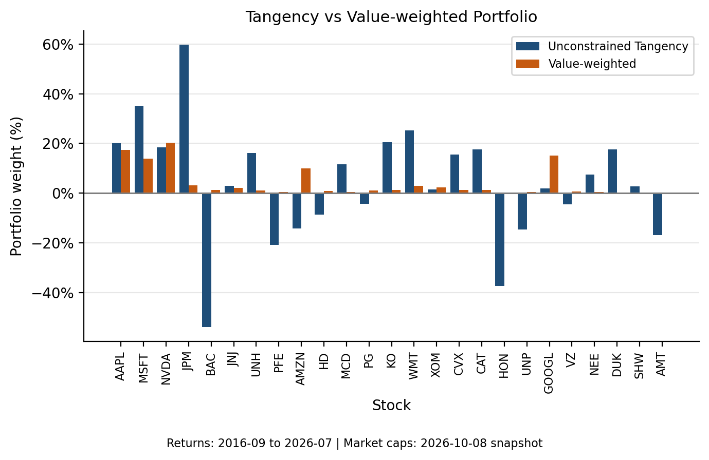

# Stage 1 — Portfolio Choice: Tangency Weights and Robustness

## Setup and full-sample allocation

We examine 25 stocks using 119 monthly observations from September 2016 to July 2026. Appendix Table A1 summarizes their raw total returns. Expected excess returns, $\mu_e$, are estimated by subtracting the same-month monthly risk-free rate from each stock return and taking sample means. The covariance matrix, $\Sigma$, uses raw risky-asset returns and the sample denominator $n-1$. Both inputs retain monthly decimal units. Appendix Table A1 annualizes arithmetic means by multiplying by 12 and sample standard deviations by multiplying by $\sqrt{12}$. The unconstrained tangency portfolio, $w_F=\Sigma^{-1}\mu_e/(\mathbf{1}'\Sigma^{-1}\mu_e)$, maximizes estimated excess return per unit of portfolio volatility. Its weights sum to one, but short positions and leveraged long positions are allowed. It is an in-sample optimum conditional on estimated inputs, not a forecast of realized performance. These inputs are estimates from a finite historical sample, not known population parameters; sampling uncertainty means they may differ from the underlying expected returns and covariances.

The full-sample allocation contains substantial offsetting positions: JPM receives +59.70%, while BAC is shorted at −53.84%. Figure 1 shows that these are part of a broader pattern of positive and negative allocations. Table 1 reports gross exposure, the sum of absolute weights, alongside the robustness results. Although net exposure is 100%, gross exposure is much larger because the budget constraint does not limit offsetting positions. These allocations are permitted by the unconstrained formulation and are not, by themselves, evidence of a computational error.

The value-weighted comparison illustrates different construction rules rather than determining which strategy is “better.” Value weights reflect company market capitalizations within the 25-stock universe; tangency weights depend on estimated expected excess returns and covariance through Sharpe optimization. A second, related distinction is that estimation error in these inputs can affect tangency allocations, particularly without constraints; capitalization weighting does not optimize these estimated moments. The benchmark uses the October 8, 2026 market-cap snapshot, after the July 2026 return-sample end. It is therefore a snapshot benchmark, not a historically rebalanced value-weighted portfolio. Figure 1 compares allocations, not realized investment performance. Appendix Table A2 provides all five allocation estimates, allowing the selected examples to be checked against the complete results.

**Figure 1. Full-sample tangency and value-weighted snapshot allocations.** Tangency weights use September 2016–July 2026 returns; value weights use October 8, 2026 market capitalizations within the 25-stock universe. **Takeaway: sample Sharpe optimization produces substantial long/short positions that differ markedly from the capitalization-based allocation.** The value-weighted portfolio is a snapshot benchmark, not a historically rebalanced portfolio; the comparison does not establish either allocation’s superiority.

## Subsample stability

We assess sample sensitivity by independently re-estimating excess means and raw-return covariance for H1 (September 2016–July 2021, 59 observations) and H2 (August 2021–July 2026, 60 observations). The optimization method remains unchanged. AAPL switches from −10.57% to +79.37%, while KO switches from −26.51% to +204.30%. These examples demonstrate changes in both the direction and magnitude of positions. Table 1, Panel A, shows the accompanying increase in gross exposure and reports the aggregate absolute weight change, $D$. This measure summarizes allocation differences across all stocks; it is not a return. Complete subsample weights appear in Appendix Table A2.

The unconstrained optimizer treats estimated means and covariances as its inputs, without distinguishing persistent opportunities from sampling noise. It can exploit relatively small estimated differences across securities through large offsetting long and short positions when estimated covariance makes their combined risk appear limited. Small input changes can therefore be amplified into large weight changes. The two halves directly demonstrate sample sensitivity through sign reversals and much higher gross exposure under different estimation periods. This is consistent with the practical importance of estimation error, but does not identify how much reflects sampling uncertainty versus genuine changes in market conditions. The exercise is not an out-of-sample performance test.

**Table 1 — Tangency Portfolio Exposure and Robustness**

**Panel A — Exposure and sample sensitivity**

| Metric | Full-sample unconstrained | H1 unconstrained | H2 unconstrained | Full-sample no-short |
|---|---:|---:|---:|---:|
| Gross exposure (%) | 449.23 | 555.02 | 1,547.22 | 100.00 |

H1–H2 aggregate absolute weight change = **1,658.77 percentage points** ($D=16.5877$). This is the sum of absolute changes in portfolio weights across stocks, **not a return**.

**Panel B — Cost of the no-short constraint**

| Metric | Unconstrained tangency | No-short tangency |
|---|---:|---:|
| Monthly fitted Sharpe | 0.548 | 0.441 |

*Full sample: September 2016–July 2026, 119 months; H1: September 2016–July 2021, 59 months; H2: August 2021–July 2026, 60 months. Gross exposure is the sum of absolute weights; all portfolios have 100% net exposure. Sharpe ratios are monthly and unitless.*

## No-short constraint and interpretation

The no-short check retains the full-sample inputs and adds non-negative weights, still summing to one. This eliminates short-financed long exposure and substantially moderates positions. It restricts the optimizer’s ability to express estimated opportunities through extreme offsetting trades. Lower fitted Sharpe is expected because the feasible set is restricted; it does not imply that the unconstrained portfolio will perform better out of sample. The solution assigns positive weights to 13 stocks; WMT is the largest holding at 19.98%. Table 1 shows the reduction in gross exposure and fitted Sharpe. Expected monthly excess return falls from 2.93% to 2.13%, while monthly volatility falls from 5.34% to 4.82%. Thus, lower volatility accompanies lower estimated excess return, rather than establishing superiority. Unlike the capitalization-based VW benchmark, the no-short portfolio remains Sharpe-optimized. The restriction does not require equal weights or eliminate concentration. It reduces extreme exposure at a cost in fitted efficiency, but this full-sample check does not establish greater stability or better expected out-of-sample performance.

The tangency portfolio can be computed successfully, yet its sample implementation produces extreme and highly period-sensitive allocations. A no-short constraint moderates this behavior at the cost of lower fitted in-sample Sharpe. Optimization identifies the estimated optimal allocation conditional on its inputs; the reliability and economic implications of that allocation require separate scrutiny. This distinction connects the empirical findings to the practical implementation of mean–variance theory.
