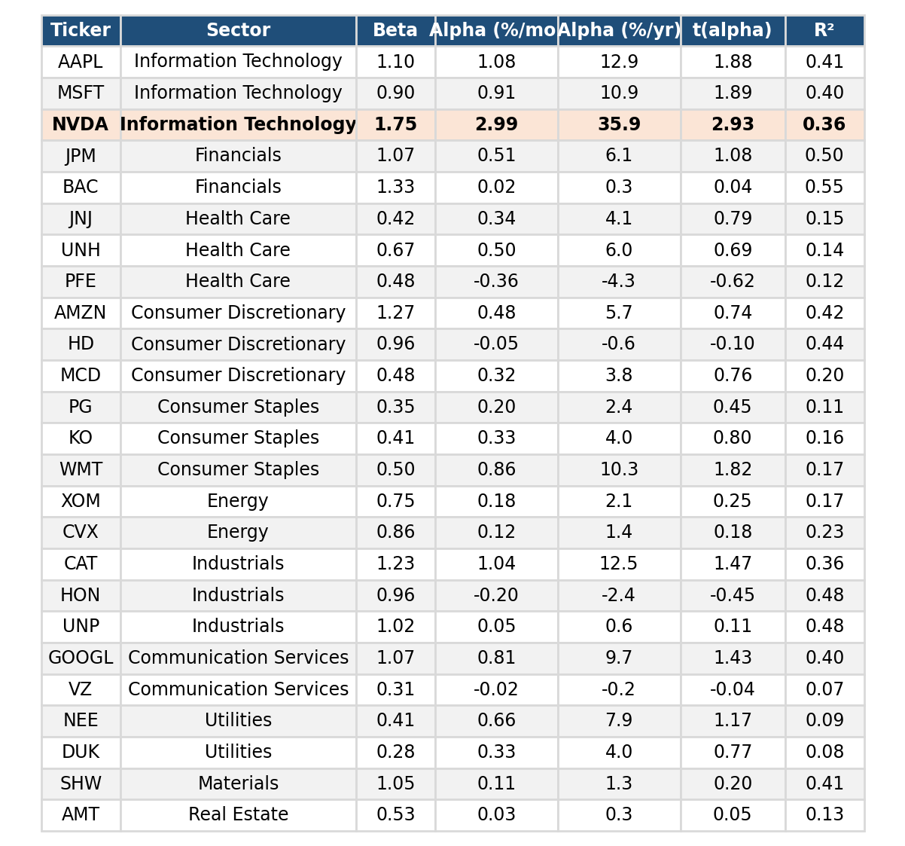
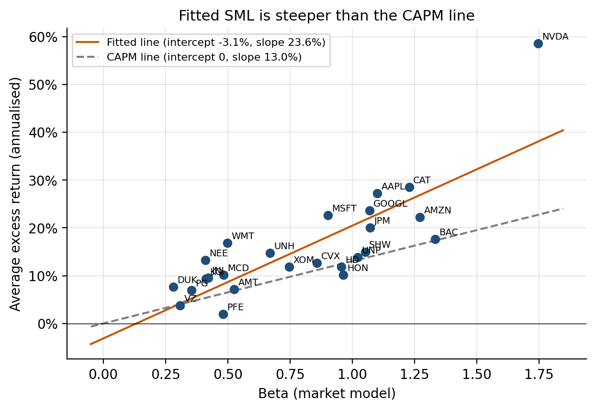
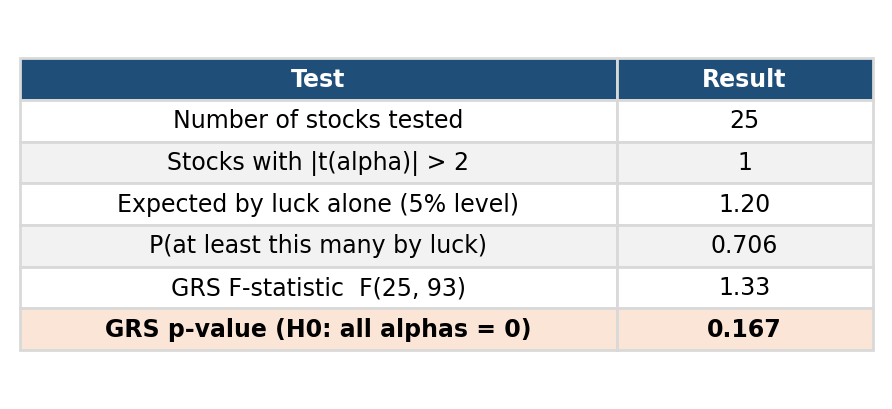
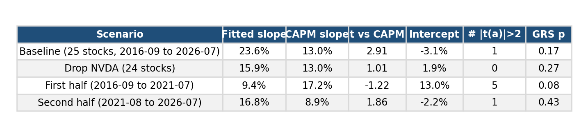

# Stage 2: Does beta explain average returns? Testing the CAPM

**Bottom line.** From September 2016 to July 2026, the claim of CAPM shows that alphas are zero is not rejected. Its claim about the *slope* of the Security Market Line (SML) rejected at first (the fitted line is much steeper than theory) given by the result. But this result relies almost entirely one stock, NVIDIA, and disappears when it is removed. We therefore treat the CAPM as "not convincingly rejected, with one fragile exception".

## 2a. Security characteristic regressions

For each of the 25 stocks we ran, there are total 119 monthly observations,

Ri,t − Rf,t = αi + βi (RM,t − Rf,t) + εi,t,

where the market excess return is the Ken French U.S. market factor and Rf is the one-month T-bill rate of the same month.

For Figure 2a, the Betas run from 0.28 (Duke Energy) to 1.75 (NVIDIA), ordered as theory suggests. For industries like utilities, staples and health care which demands are stable sit below 0.7, while NVIDIA, Bank of America, Amazon and Caterpillar whose demands are changing cyclically sit above 1.2. But only NVIDIA has a significant alpha. Alphas are monthly and annualised.

The market explains that on average, only 28% of a single stock's variance. The R² ranges from 0.07 for Verizon to 0.55 for Bank of America. The rest is firm-specific risk, which the CAPM says earns no premium.

## 2b. The empirical SML

For each stock we plot its average excess return against its estimated beta. The CAPM line passes through the origin with a slope equal to the average market excess return with 13.0% per year. The fitted line is an ordinary least squares regression of the 25 average excess returns on the 25 betas.

For Figure 2b, the fitted SML (orange) is steeper than the CAPM line (grey dashed). This implies that high-beta stocks earned more, and low-beta stocks earn less than their betas justify. NVIDIA pulls the fitted line up strongly to the top right.

## 2c. Are all alphas zero?

After testing 25 alphas at the 5% level, we would expect about 25 × 4.8% = 1.2 significant results by chance alone even if the CAPM were exactly true. We found one, which is NVIDIA with t = 2.93. The probability of seeing at least one by chance is 71%, so this count is not unusual.

A joint test is more reliable than counting, because it uses the correlation between residuals of stocks. The Gibbons-Ross-Shanken (GRS) test of "all 25 alphas are zero" gives F(25, 93) = 1.33 with p = 0.167, so we do not reject.

For Figure 2c, one significant alpha out of 25 is what luck alone would produce, expected to be 1.2, and the joint GRS test does not reject zero alphas (p = 0.17).

But "not rejected" is not "confirmed". With 119 months and 25 assets the test has limited power, and small alphas would go undetected.

## 2d. Fitted SML versus theory

| | Intercept (per year) | Slope (per year) |
|---|---|---|
| CAPM prediction | 0.0% | 13.0% (average market excess return) |
| Fitted (25 stocks) | −3.1% (t = −0.97) | 23.6% (s.e. 3.6%) |
| Difference | not significant | +10.6 points, t = 2.91 |

Cross-sectional R² is 0.65.

Normally, the finding in the literature is a line that is too flat with an intercept too high. The low-beta stocks earn more than the CAPM predicts and high-beta stocks earn less. But We find the opposite. The intercept is slightly negative and statistically indistinguishable from zero, and the slope is too steep.

There are possible three reasons that may explain why our sample differs:

1. **One dominant stock.** NVIDIA has the highest beta (1.75) and the highest average excess return (58.6% per year). With only 25 points, a single point this far from the others strongly tilts the line (see the robustness check below).
2. **Survivorship bias.** The 25 stocks were chosen from today's S&P 500 and followed back ten years. Firms that fell out of the index are missing. This overstates the returns of high-beta winners such as NVIDIA and Apple, which steepens the line (see `data_notes.md`, section 6).
3. **An unusual decade.** 2016 to 2026 was a strong period for technology stocks, which are also high-beta. A different ten years could give a different slope.

But one effect works against our result. The estimation error in beta usually biases the fitted slope downwards, which towards a flatter line, so measurement error cannot explain why our line is steeper. It also means that the standard error above is only a rough guide. It does not correct the beta estimation error or for correlation across residuals of stocks.

## Robustness check:

Because the steep slope is our one apparent rejection of the CAPM, we want to know whether it survives after two reasonable changes. The first one is removing NVIDIA. The second change is splitting the sample into two halves of about five years. Within each half, betas and the CAPM slope are re-estimated from that half only.

For figure 2e, the steep slope does not survive. We can see from the figure, without NVIDIA the fitted slope falls from 23.6% to 15.9%, and closer to the CAPM's 13.0% (t = 1.0). And the two sub-periods point in opposite directions, it is flatter in the first half, and steeper in the second.

This changes how we read the evidence:

- Without NVIDIA the fitted slope (15.9%) is no longer significantly different from theory, and no stock has a significant alpha. The conclusion of previous test "the SML is too steep" is therefore driven by one observation.
- Across periods, the slope is unstable. In 2016 to 2021 the fitted line was flatter than the CAPM line (9.4% versus 17.2%) with a high intercept (13.0% per year), which is same as the textbook pattern, and five stocks had significant alphas (GRS p = 0.08, borderline). In 2021 to 2026 it was steeper (16.8% versus 8.9%). With about 60 months per half the estimates are noisy, so neither half is conclusive on its own. The sign flip itself suggest that the slope depends on the period.

## Conclusion for Stage 2

Alphas are jointly consistent with zero, and the apparent failure of the SML slope is fragile. It depends on NVIDIA and on the choice of period. We do not claim the CAPM holds. We can only say the data cannot reject it firmly.

