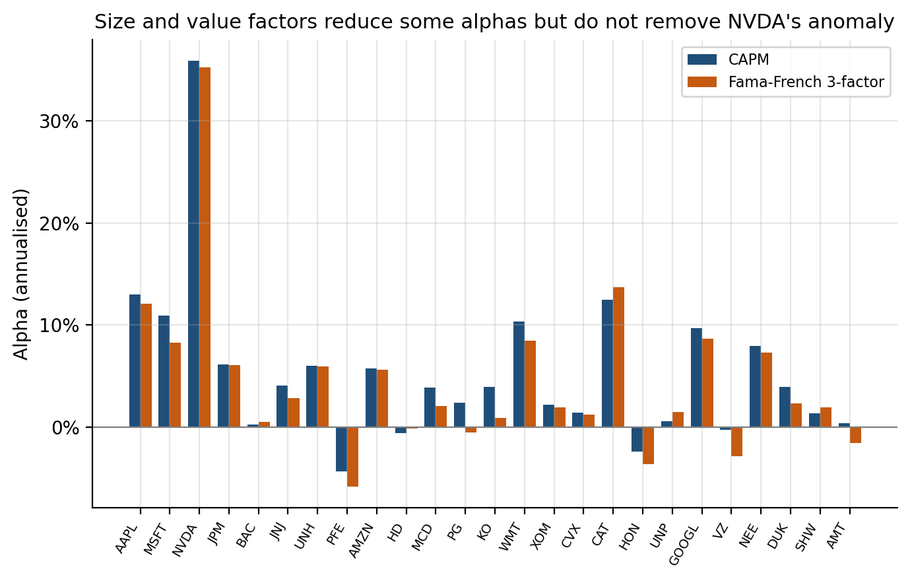

# Stage 3 · Adding Size and Value Factors

## 3.1 Factor setup

Stage 2 used the CAPM, where the market excess return was the only systematic risk factor. In Stage 3, we add SMB and HML to test whether the CAPM alphas can be explained by size and value effects. The model becomes:

$$
R_{i,t}-R_{f,t}
=
\alpha_i
+\beta_{M,i}(R_{M,t}-R_{f,t})
+\beta_{SMB,i}SMB_t
+\beta_{HML,i}HML_t
+\varepsilon_{i,t}.
$$

We use the same sample as in Stage 2, from September 2016 to July 2026, with 119 monthly observations. All returns are monthly decimals. The market factor, SMB, HML and the risk-free rate come from the same Ken French file, so the data are consistent across the two stages. SMB stands for Small Minus Big and is a long-short factor that captures the return difference between portfolios of small and large firms. A positive SMB loading suggests stronger exposure to small-firm returns, while a negative loading is more consistent with large-cap behaviour. HML stands for High Minus Low and is a long-short factor based on the return difference between high and low book-to-market portfolios. A positive HML loading suggests stronger value exposure, while a negative loading is more consistent with growth stocks.

The estimated factor loadings show several clear patterns. NVDA, MSFT and AMZN all have negative HML loadings, with NVDA close to -1.00, which is consistent with their growth characteristics. In contrast, JPM, BAC, XOM and CVX have strong positive HML loadings, which is more in line with value exposure.

## 3.2 Changes in alpha and model fit

Figure 3b compares annualised alphas under the CAPM and the Fama-French three-factor model. After SMB and HML are added, the mean absolute annualised alpha falls only slightly, from 6.00% to 5.64%. The change is also not uniform across stocks: some alphas become smaller, while others become slightly larger. This suggests that size and value exposure explain only a limited part of the average abnormal returns left by the CAPM.

The stronger improvement appears in model fit. Average $R^2$ rises from 0.282 under the CAPM to 0.379 under the three-factor model. This means that SMB and HML explain a larger share of the month-to-month return variation, even though they do not reduce average alpha by the same amount.

$R^2$ measures how well the model explains return variation over time, while alpha measures the average return that remains unexplained after controlling for the factors. A model can therefore fit monthly return movements better without removing the intercept. Financial and energy stocks provide a clear example. JPM's $R^2$ rises from 0.498 to 0.712, while its annualised alpha changes only from 6.12% to 6.05%. The same pattern appears for XOM and CVX. Their $R^2$ values increase from 0.175 to 0.454 and from 0.231 to 0.467, while their annualised alphas change only from 2.16% to 1.94% and from 1.44% to 1.22%.

**Figure 3b.** Adding SMB and HML changes the CAPM alphas only modestly across most stocks, suggesting that size and value factors explain only a limited part of the abnormal returns left by the CAPM. NVDA remains the only statistically significant anomaly.

## 3.3 Which Stage 2 anomalies remain?

NVDA was the only stock with a significant CAPM alpha using the $|t|>2$ rule. Its CAPM alpha was about 2.99% per month, or 35.9% per year, with a t-statistic of 2.93. After adding SMB and HML, its alpha remains about 2.94% per month, or 35.2% per year, while the t-statistic rises slightly to 3.04. This means that the NVDA anomaly is not absorbed by the size and value factors. At the same time, the three-factor model explains more of NVDA's return variation: its $R^2$ rises from 0.357 to 0.447, and its HML loading is close to -1.00, showing strong growth exposure. SMB and HML therefore explain more of how NVDA moves from month to month, but they do not explain away its unusually high average return.

Overall, Stage 3 shows that SMB and HML improve the explanation of return movements more than they improve the explanation of abnormal average returns. The factor loadings are economically sensible and the regressions fit the data better, especially for stocks with strong value or growth exposure. However, the significance pattern remains almost unchanged, and NVDA is still the only significant anomaly after the additional factors are included.